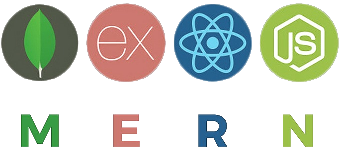
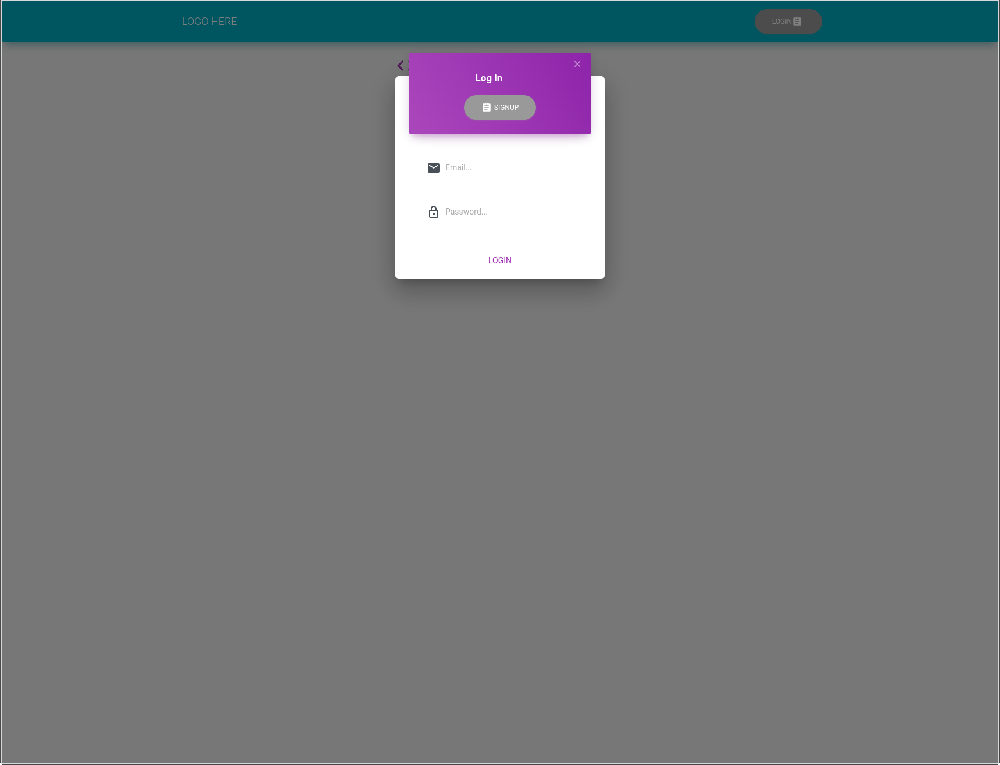

[![Contributors][contributors-shield]][contributors-url]
[![Forks][forks-shield]][forks-url]
[![Stargazers][stars-shield]][stars-url]
[![Issues][issues-shield]][issues-url]
[![MIT License][license-shield]][license-url]

<!-- PROJECT LOGO -->
<br />
<p align="center">
  <a href="https://github.com/adam-spice/mernplate">
    
  </a>

  <h3 align="center">MERN Plate</h3>

  <p align="center">
    A boiler plate app for the MERN stack that includes authentication.
    <br />
    <br />
    <a href="https://github.com/adam-spice/mernplate">View Demo</a>
    ·
    <a href="https://github.com/adam-spice/mernplate/issues">Report Bug</a>
    ·
    <a href="https://github.com/adam-spice/mernplate/issues">Request Feature</a>
  </p>
</p>

<!-- TABLE OF CONTENTS -->

## Table of Contents

- [About the Project](#about-the-project)
  - [Built With](#built-with)
- [Getting Started](#getting-started)
  - [Prerequisites](#prerequisites)
  - [Installation](#installation)
- [Usage](#usage)
- [Roadmap](#roadmap)
- [Contributing](#contributing)
- [License](#license)
- [Contact](#contact)
- [Acknowledgements](#acknowledgements)

<!-- ABOUT THE PROJECT -->

## About The Project

<p align="center">

</p>

I am just starting out as a developer and found that during my day to day learning I was writing the same code
over and over again. So, I came up with the idea of making a boilerplate for it that I can easily change when I need too.

### Built With

- [NodeJs](https://nodejs.org/en/)
- [Express](https://expressjs.com/)
- [React](https://create-react-app.dev/)
- [MongoDB](https://www.mongodb.com/)
- [Mongoose](https://mongoosejs.com/)
- [Material-ui](https://material-ui.com/)
- [MaterialKitProReact](https://demos.creative-tim.com/material-kit-pro-react/#/documentation/tutorial)

<!-- GETTING STARTED -->

## Getting Started

To get a local copy up and running follow these simple steps.

### Prerequisites

This is an example of how to list things you need to use the software and how to install them.

- npm

```sh
npm install npm@latest -g
```

- mongo
  Make sure you have mongo installed locally or have access to a cloud database like [MongoDB Atlas](https://www.mongodb.com/cloud/atlas)

### Installation

1. Clone the repo

```sh
git clone https://github.com/adam-spice/mernplate.git
```

2. Change into the cloned folder

```sh
cd mernplate
```

3. Install NPM packages

```sh
npm run install:all
```

The above command will install all the packages for the both the server and client.

<!-- USAGE EXAMPLES -->

## Usage

To start the app in dev mode run

```sh
npm run dev
```

This will start the express server and the create-react-app development server using concurrently

To start in production mode run

```sh
npm start
```

This will build an optimized version of the client in the build folder and then start the express server

<!-- ROADMAP -->

## Roadmap

See the [open issues](https://github.com/adam-spice/mernplate/issues) for a list of proposed features (and known issues).

<!-- CONTRIBUTING -->

## Contributing

Contributions are what make the open source community such an amazing place to be learn, inspire, and create. Any contributions you make are **greatly appreciated**.

1. Fork the Project
2. Create your Feature Branch (`git checkout -b feature/AmazingFeature`)
3. Commit your Changes (`git commit -m 'Add some AmazingFeature'`)
4. Push to the Branch (`git push origin feature/AmazingFeature`)
5. Open a Pull Request

<!-- LICENSE -->

## License

Distributed under the MIT License. See `LICENSE` for more information.

<!-- CONTACT -->

## Contact

Adam Spice - [email]

Project Link: [https://github.com/adam-spice/mernplate](https://github.com/adam-spice/mernplate)

[contributors-shield]: https://img.shields.io/github/contributors/adam-spice/mernplate?style=flat-square
[contributors-url]: https://github.com/adam-spice/mernplate/graphs/contributors
[forks-shield]: https://img.shields.io/github/forks/adam-spice/mernplate?style=flat-square
[forks-url]: https://github.com/adam-spice/mernplate/network/members
[stars-shield]: https://img.shields.io/github/stars/adam-spice/mernplate?style=flat-square
[stars-url]: https://github.com/adam-spice/mernplate/stargazers
[issues-shield]: https://img.shields.io/github/issues/adam-spice/mernplate?style=flat-square
[issues-url]: https://github.com/adam-spice/mernplate/issues
[license-shield]: https://img.shields.io/github/license/adam-spice/mernplate?style=flat-square
[license-url]: https://github.com/adam-spice/mernplate/blob/master/LICENSE.txt
[product-screenshot]: images/screenshot.png#screenshot
[email]: adam@adam-spice.online
